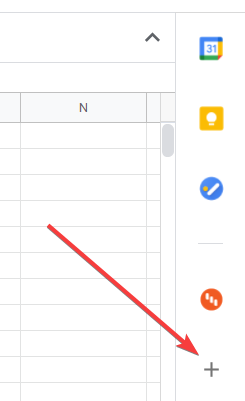
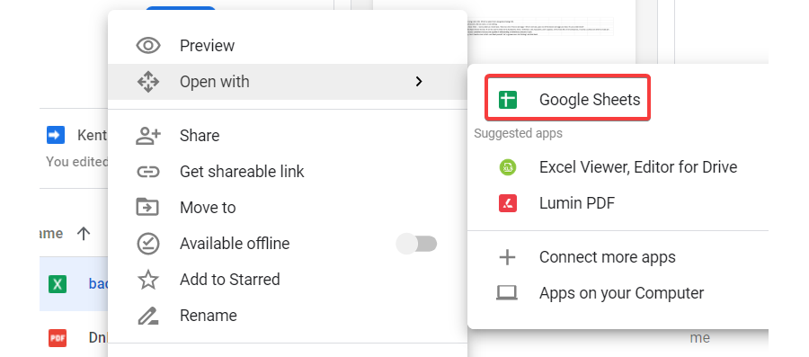
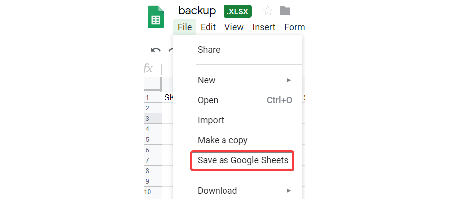
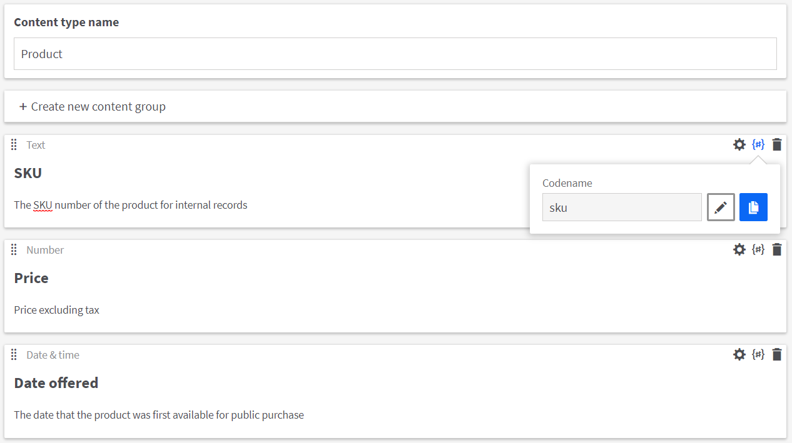
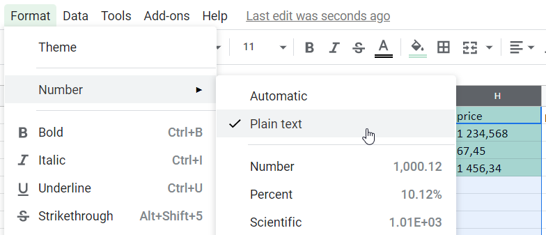

[](https://stackoverflow.com/tags/kentico-kontent)

#  Google Sheets Import

- [Installation](#installation)
- [Preparing the Sheet](#preparing-the-sheet)
  - [Setting the headers](#setting-the-headers)
- [Formatting cell values](#formatting-cell-values)
  - [Setting Rich Text values](#setting-rich-text-values)
  - [Components in Rich Text](#components-in-rich-text)
- [Importing the content](#importing-the-content)
  - [Locating and updating existing items](#locating-and-updating-existing-items)
  - [Batching](#batching)
- [Exporting items from Kontent](#exporting-items-from-kontent)

# Installation
You can install this Google Workspace add-on [here](https://workspace.google.com/marketplace/app/kentico_kontent/482429381322) or directly from Google Sheets using this button in the sidebar:



After installing, click the Kontent icon in the sidebar to load the add-on's home page. Locate the following API keys in Kontent, then add them in the addon's __Project settings__ menu, 

- Project ID
- Preview API key
- Management API key

# Preparing the Sheet
You may create a new Sheet or edit an existing one. The __Generate Sheet__ menu of the add-on can also generate a new Sheet for you, along with the required headers, based on the project's content types.

If you have a local spreadsheet file, you can open it in Google Sheets by uploading it to Google Drive, then selecting _Open with > Google Sheets_.



Once the file is open in Sheets, you must re-save it as a Google Sheet file:



> :warning: The name of the Sheet must match the code name of the content type in your project which will be used to create items

If you used the __Generate Sheet__ menu to create the Sheet, the code name of the content type will be automatically generated. If you are creating the Sheet manually, you can find the content type code name in Kontent:


## Setting the headers

The headers (first row) of your Sheet must contain the code names of the content type's elements. If you use the __Generate Sheet__ menu of the add-on, these headers will be automatically generated. If adding headers manually, you can find the code names of the elements when editing the content type in https://app.kontent.ai.



In addition to the element code names, the header row can also contain these other headers:

- __name__ (required): The name of the content item to create or update.
- __external_id__ (optional): The [external ID](https://docs.kontent.ai/reference/management-api-v2#section/External-IDs-for-imported-content) of the content item to update.
- __codename__ (optional): The codename of the content item being created/updated.
- __language__ (optional): The language of the variant to update. This should match the code name of a language in the project’s Localization page, and is case sensitive. If a language is not provided, the add-on will get the project's default language using Management API.
- __currency_format__ (optional): Used to determine how values for Kontent "number" elements are parsed. US-formatted strings ("1,500.75") and EU-formatted strings ("1 500,75") are parsed into a valid number based on this setting. Should be either `US` or `EU`. If omitted or empty, US formatting will be used.
- __rich_text_components__ (optional): JSON data of components used in all rich text elements of the row. See [Components in rich text](#components-in-rich-text)

:bulb: See the [Locating and updating existing items](#locating-and-updating-existing-items) section to read more about how existing items are located and how to update content item names and codenames.

The following is an example of what a Sheet named __product__ might look like:

 | external_id | sku | name | price |	date_offered |
 | ----------- | --- | ---- | ----- | ------------ |
 | F4891FB5-5215-4795-8A6F-18A4F68394FD |	CO-ETH-YIRGACHEFFE |	Ethiopia Yirgacheffe (decaf) | 3.5 | 2017-01-10 15:46:54.5576119 |
 | DD84A64C-F0BE-42AA-9F47-228ED6520D27 |	CO-ETH-YIRGACHEFFE-5-lb |	Ethiopia Yirgacheffe (decaf) (5 lb) | 52 | 2017-01-10 16:02:44.6796146 |
 | 031A9DE2-51F4-41F7-B2FE-5825FBAADD6C |	CO-ETH-YIRGACHEFFE-4-oz |	Ethiopia Yirgacheffe (decaf) (4 oz) | 3.5 | 2017-01-10 16:02:44.6186085 |
 | FE991A97-3998-4FA0-9DF7-59A00622297B |	CO-ETH-YIRGACHEFFE-16-oz | Ethiopia Yirgacheffe (decaf) (16 oz) | 12 | 2017-01-10 16:02:44.5085975 |
 
## Formatting Cell Values
To avoid errors in importing data, the data in each column must be formatted according to the element it will be stored in. Most elements (such as Text and Number) are straight-forward, but some require specific formatting:

- __Rich Text__: See [Setting Rich Text values](#setting-rich-text-values)
- __Number__: If the value is not a valid `float` like "12.50" the script will try to parse the number based on the __currency_format__ value (see [Setting the headers](#setting-the-headers)). As US and EU formats are currently supported, some examples of valid numbers are: `1,500.75`, `1.500,75`, and `1 500,75`. The cell should not contain letters or currency symbols.  
If you are using EU formatting, we recommend changing any Number columns in the Sheet to use __Plain text__ formatting:



- __Date & Time__: The script will first try to parse the value using the JavaScript [Date(string) constructor](https://developer.mozilla.org/en-US/docs/Web/JavaScript/Reference/Global_Objects/Date), so any valid DateTime string will succeed. A typical valid string would be in the format `mm/dd/yyyy hh:mm am/pm`. The script will also accept strings that use dashes instead of slashes (`12-25-2019 6:00 AM`) or timestamps from SQL (`2019-12-25 06:00:00.0000000`).
- __URL Slug__: There is no special formatting needed for URL Slug elements. If a value is provided, the element's `mode` will be changed to "custom" and no longer auto-generate based on another content type element. To revert the URL Slug element back to auto-generation, set the value to `#autogenerate#`.
- __Taxonomy, Multiple Choice, Assets, Linked items__: Values for these elements follow the same format:  `<identifier type>:<identifier>` in a comma-separated list. The identifier can be `id`, `codename`, or `external_id` depending on the type of element.  
An example of multiple linked items in an element is `codename:birthday_party,id:eba1015a-dfd4-5736-abc1-5de3ed5df732`. You can find the supported reference types for each element in [our documentation](https://docs.kontent.ai/reference/management-api-v2#tag/Elements-in-language-variants), or in the table below:
  | Element         | Allowed references         |
  | --------------- | -------------------------- |
  | Asset           | id, external_id            |
  | Linked items    | id, external_id, codename  |
  | Multiple choice | id, codename               |
  | Taxonomy        | id, external_id, codename  |  

### Setting Rich Text values

 This element will most likely require the most pre-processing; try to avoid complex HTML and text formatting. The list of supported HTML elements and their syntax can be found in our [documentation](https://docs.kontent.ai/reference/management-api-v2#section/Rich-text-element/html5-elements-allowed-in-rich-text).
Notably, you can insert links to other content items or assets by referencing and ID or external ID using the format described in [this section](https://docs.kontent.ai/reference/management-api-v2#section/Rich-text-element/links-in-rich-text).

For example: `Buy our <a data-item-external-id="F4891FB5-5215-4795-8A6F-18A4F68394FD">new coffee</a>`. You can also add inline content items using the syntax [here](https://docs.kontent.ai/reference/management-api-v2#section/Rich-text-element/content-items-in-rich-text), for example `<object type="application/kenticocloud" data-type="item" data-external-id="59713"></object>`.

Or, you can use special macros designed for this add-on. In the list below, the `identifier_type` can be "id" or "external-id":  
  | macro | description | format | example |
  | ----- | ----------- | ------ | ------- |
  | link-item | Inserts a link to a content item | `macro:identifier_type:identifier:text` | `##link-item:id:5946ca5d-cebe-4be1-b5f0-4cd0a0e43fb5:coffee is good##` |
  | link-asset | Inserts a link to an asset | `macro:identifier_type:identifier:text` | `##link-asset:id:0013263e-f2a9-40b1-9a3e-7ab6510bafe5:asset##` |
  | item | Inserts an inline content item | `macro:identifier_type:identifier` | `##item:external-id:article6##` |

You can insert content item links, asset links, and inline content items by entering the HTML or macro manually. Or, you can use the **Rich text macros** menu found in the add-on to insert macros:


### Components in rich text

You can use the `rich_text_components` column to store all components of a content item, regardless of how many Rich Text elements it contains. When exporting items from Kontent, the components are automatically generated.
For example, if you have a Rich Text element that contains this component:

```
<object type="application/kenticocloud" data-type="component" data-id="382abced-bfb6-4ee9-a2d4-2c3b8cd8ba5d"></object>
```

then the `rich_text_components` must contain a component with that ID, or the import will fail. The format of components can be found in [our documentation](https://docs.kontent.ai/reference/management-api-v2#section/Rich-text-element/component-object). Using the above example, the `rich_text_components` value could look like this:

```
{
  "id": "382abced-bfb6-4ee9-a2d4-2c3b8cd8ba5d",
  "type": {
    "codename": "article"
  },
  "elements": [
    {
      "element": {
        "id": "975bf280-fd91-488c-994c-2f04416e5ee3"
      },
      "value": "This is some text in the component"
    }
  ]
}
```

# Importing the Content
Click the Kontent icon in the sidebar and open the __Import__ menu. You have two options before starting the import:


- __Update existing items__:
If enabled, an existing content item will attempt to be updated using the `external_id` of each row, or the `name` if there is no external ID column. If you disable it, a new item will always be created, but be aware that you may run into errors if you’ve provided an external ID that already exists in the system. As is the case with all errors, the script will simply skip that record and continue processing the rest of the Sheet.

- __Preload content items__: If enabled, the script will load _all_ content items from your project at the start. When attempting to locate existing items, the script will use the cached data, greatly reducing the number of API calls and execution time.  

After clicking the __Run__ button, please wait while the script runs. When it’s finished, a new window Sheet is created containing a detailed record of the operations taken per-row and general information:


## Locating and updating existing items

Depending on what information is available in the sheet, existing items in your project are located differently. This is the order in which values are used to locate existing items:

1. __external_id__: If not found, a new item is created with this ID. For both new items and existing items found this way, you are able to update the `name` and `codename` of the content item if those values are present in the row.
1. __codename__: If not found, a new item is created with this codename. When updating existing items found this way, you can only update the `name`.
1. __name__: If not found, a new item is created with this name. For new items created this way, you can set the `codename` and `external_id`. If an existing item was found, you can only update the `codename` of the item.

## Batching

The import process will run for a maximum of 30 seconds. If your Sheet contains a large amount of data that cannot be completed within 30 seconds, the import will be performed in batches. You will be shown a menu stating which rows were successfully processed, and you can click **Resume** to continue importing the Sheet.

# Exporting items from Kontent

Using the __Export__ menu, you can save all your content items in Google Sheets, allowing you to create backups to import into the same project or even other projects. When you export your items, the add-on will generate a new Sheet for each content type in the project. Then, each Sheet will be populated with the content items of that type.

There is an optional __Translate IDs__ setting you can enable before exporting. This add-on uses the Management API to retrieve your data, and references to objects like taxonomy, assets, etc. use the internal `id` of the object. If you enable this setting, the ID will be converted into either a `codename` or `external_id` if available.

This is helpful if you are considering exporting items from Project A and into Project B. Both projects may have a taxonomy term called "Events," but the `id` of the term will be different. If the codename is "events" in both projects, the content items which reference that taxonomy term can be imported without any issues.

# Contributing
To develop and test this Google Script project, first install [this Chrome extension](https://chrome.google.com/webstore/detail/google-apps-script-github/lfjcgcmkmjjlieihflfhjopckgpelofo?hl=en) which integrates Google Scripts with Git. Then fork this repository and create a new Google Script project on https://script.google.com/.

Use the new menus added by the extension (Repository, Branch, ..) to pull the code from your forked repository into the Script project. After you've made the desired code changes, test the add-on in a Google Sheet using the Deploy > Test deployments_ menu.

